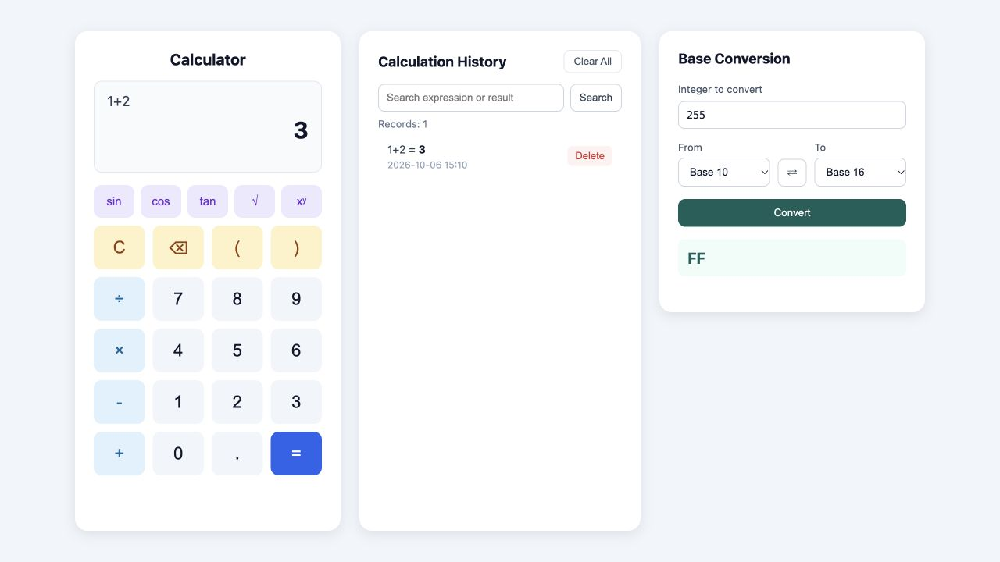

# Calculator Frontend

## Project Overview

This is the frontend of my EE308 calculator project. It uses HTML, CSS and JavaScript. The frontend sends requests to the Java backend and shows the results. It does not calculate answers itself.

[Backend repository](https://github.com/easonwang815/832402120_calculator_backend)

## Features

- Basic arithmetic, brackets, decimals and negative numbers
- Powers, square roots, sin, cos and tan
- Calculation history, search, pages and deletion
- Conversion between base 2, 8, 10 and 16
- Keyboard input: Enter to calculate, Backspace to delete and Escape to clear

## How It Works

~~~text
User input -> API request -> Backend calculation -> Saved history
           <- Answer and updated history
~~~

`app.js` reads the buttons and keyboard input. `api.js` sends the expression to the backend using `fetch`. When the answer comes back, the page shows it and loads the latest history. The frontend does not evaluate expressions.

## Using the Calculator

Use the number and operator buttons to enter an expression, then click `=` or press Enter. Use `C` to clear the current expression and the backspace button to remove its last character.

| Expression | Answer |
|---|---|
| `1+2*3` | `7` |
| `(1+2)*3` | `9` |
| `sqrt(9)+2^3` | `11` |
| `sin(30)` | `0.5` |

The scientific buttons enter function names for you. Trigonometric functions use degrees.

The history panel shows five records per page. Enter part of an expression or result and click Search to find a record. Delete removes one record. Clear All asks for confirmation before clearing the history.

For base conversion, enter an integer, choose the From and To bases, then click Convert. For example, `255` in Base 10 becomes `FF` in Base 16. The swap button exchanges the two bases.

## Screenshot

## Project Structure

- `index.html`: the calculator page
- `css/style.css`: page styles
- `js/api.js`: requests to the backend
- `js/app.js`: buttons, results and history
- [`codestyle.md`](codestyle.md): the code style used in this project

## Requirements

Use a modern browser and Python 3. To run the whole project locally, the backend also needs Java 17 and Maven 3.9.

## How to Run

Place the frontend and backend folders in the same parent folder.

In the first terminal, start the backend from the parent folder:

~~~bash
cd 832402120_calculator_backend
mvn spring-boot:run
~~~

In a second terminal, start the frontend from the same parent folder:

~~~bash
cd 832402120_calculator_frontend
python3 -m http.server 8000
~~~

Open [http://localhost:8000/](http://localhost:8000/) in your browser. Type `1+2` and press Enter. The result should be `3`, and it should appear in the history.

Keep both terminals running. Press Ctrl+C in each terminal to stop the project.

## Online Demo

[Open the calculator](http://47.98.182.108/)

The frontend and backend run on one Alibaba Cloud server in Hangzhou. The frontend uses `/api` to contact the backend. The server trial ends on November 6, 2026.

This demo uses HTTP and shares history between visitors. Please do not enter private information.
